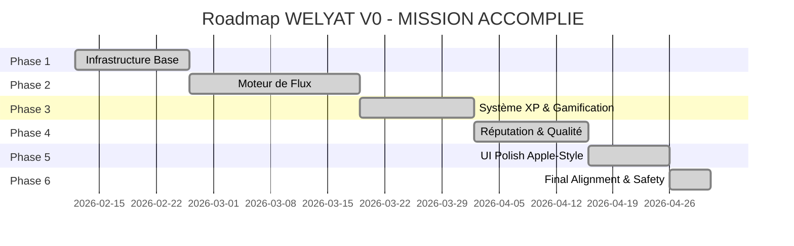

# 📋 SINA V0 - Kanban Board Complet ✅

> **Organisation chronologique de toutes les tâches du projet**  
> Légende : 🔴 Critique | 🟡 Important | 🟢 Normal | ⚪ Nice-to-have

---

## 🎯 Vue d'Ensemble des Phases (Terminée 🚀)

---

## 📦 PHASE 1 : INFRASTRUCTURE BASE (Terminée ✅)
- [x] Setup Express server (app.js)
- [x] Inscription / Connexion (Bcrypt + JWT)
- [x] Intégration Stripe (Pre-auth 20$)
- [x] Intégration Twilio (Alice Voice)
- [x] Seed Data (13 profils de test)

---

## ⚙️ PHASE 2 : MOTEUR DE FLUX & BILLING (Terminée ✅)
- [x] Matching Service (Optimisé par réputation)
- [x] Flux d'Appel Complet (FSM)
- [x] Timers (Bridge Fees & Alertes)
- [x] Plafond horaire (19,99$/h)
- [x] Système d'Urgence (SINA Shield 911/112)

---

## ☁️ PHASE 3 : SYSTÈME XP & GAMIFICATION (Terminée ✅)
- [x] Worker `XPCalculatorWorker.js` (1 XP / 5 min free)
- [x] Service `CloudXPService.js` (Marge 48%)
- [x] "Cloud Button" Admin (Redistribution au prorata des XP)

---

## 🛡️ PHASE 4 : RÉPUTATION & QUALITÉ (Terminée ✅)
- [x] Scoring Service (Détection Parlant Toxique)
- [x] Reset de priorité "Pardon" (10h d'écoute)
- [x] Système de feedback complet (Transactions Meta)

---

## 🍎 PHASE 5 : UI POLISH & APPLE-STYLE (Terminée ✅)
- [x] Design iOS Premium (Glassmorphism & Mesh)
- [x] Refonte Dashboard global (Tab Bar Navigation)
- [x] Profile Bubble & Call History Modal (Atomic UI)

---

## ⚖️ PHASE 6 : FINAL ALIGNMENT & SAFETY (Terminée ✅)
- [x] Founding Listener Boost (+10% commission)
- [x] Circuit Breaker (Auto-pause if margin < 48%)
- [x] Audio Alert Alice English ("Paid in 2 minutes...")
- [x] Global Safety Disclaimer (Auth & Dashboard)

---

**WELYAT V0 - 100% OPÉRATIONNEL 🚀**
